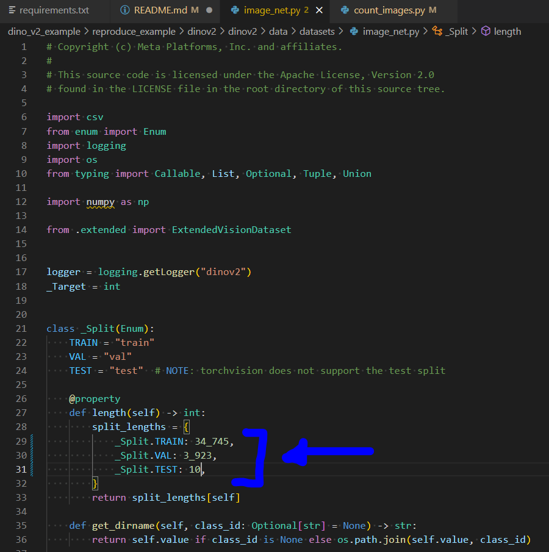

# Reproducible Steps to Run DinoV2 on (smaller version of) ImageNet 1k

The steps below allow you to train DinoV2 on ImageNet, to get a hang of how to use the architecture in isolation on a toy dataset

I will assume you have already cloned this repo on the server to run some of the scripts mentioned in here (or can just upload the scripts and run them somehow):

```sh
git clone https://github.com/QTIM-Lab/dinov2_imagenet1k_example.git
```

## 1. Clone the DinoV2 Repo

The DinoV2 repo is publicly available at the webpage: [https://github.com/facebookresearch/dinov2](https://github.com/facebookresearch/dinov2)

On the server, clone the DinoV2 repo:

```sh
git clone https://github.com/facebookresearch/dinov2.git
cd dinov2
```

We will also need to make some very minor changes to the code base in later steps, but next let's get the python environment ready

## 2. Set up python environment

There are two main ways I recommend to get the python enviornment ready, conda or just pip with any other python environment (virtualenv, etc.)

### 2.1 Set up python environment with Conda

As recommended by their repo, they provide a conda package:

```sh
conda env create -f conda.yaml
conda activate dinov2
```

However, when attempting to create this conda package, it did give me an error because the PyTorch and other package are outdated and not provided on the conda channels. But we do need to use the exact package recommended, or else the torch.distributed runner gets upset. You can either try to fix this yourself, or do the following:

Just create an empty conda environment, and then enter the environment and perform pip installs

```sh
# You can name it anything, doesn't have to be "dinov2"
conda create --name dinvo2 python=3.9
conda activate dinov2
pip install --upgrade pip
# ... then follow the "2.2 Set up python with Pip" instructions below
```

We should most likely investigate how to solve this issue in the future because for running in FL/Flower it might be annoying to have to use their torch.distributed set up, which requires these legacy packages, but for now and initial reproducibility, I suggest the above

### 2.2 Set up python with Pip

In either a conda environment, or any other python environment, use pip to install the requirements.txt

```sh
pip install -U -r requirements.txt
```

### 2.3 Python environment summary

For conciseness, here is what I recommend:

- Create either new conda environment, or use a virtualenv, or some other python environment manager
- Use pip to install as shown in 2.2

You should now have a working python environment ready to run DinoV2 module

## 3. Download ImageNet 1k Data

When we use our own data, we can change the structure to however we want. But this will work given their dataset.py (`dinov2/dinov2/data/datasets/image_net.py`) file, which needs to know things about the folder structure/data, so let's follow this example:

Recall that the required folder structure for the DinoV2's provided ImageNet 1k dataset script is like this:

`/data/...`

The root directory of the dataset (i.e. in the example, I will assume it is `/data/`) should hold the following contents:

- `<ROOT>/test/ILSVRC2012_test_00000001.JPEG`
- `<ROOT>/test/[..]`
- `<ROOT>/test/ILSVRC2012_test_00100000.JPEG`
- `<ROOT>/train/n01440764/n01440764_10026.JPEG`
- `<ROOT>/train/[...]`
- `<ROOT>/train/n15075141/n15075141_9993.JPEG`
- `<ROOT>/val/n01440764/ILSVRC2012_val_00000293.JPEG`
- `<ROOT>/val/[...]`
- `<ROOT>/val/n15075141/ILSVRC2012_val_00049174.JPEG`
- `<ROOT>/labels.txt`

The provided dataset implementation expects a few additional metadata files to be present under the extra directory:

- `<EXTRA>/class-ids-TRAIN.npy`
- `<EXTRA>/class-ids-VAL.npy`
- `<EXTRA>/class-names-TRAIN.npy`
- `<EXTRA>/class-names-VAL.npy`
- `<EXTRA>/entries-TEST.npy`
- `<EXTRA>/entries-TRAIN.npy`
- `<EXTRA>/entries-VAL.npy`

Assuming you want to store everything in some folder called `/data`:

All you need to have is:

- `/data/root/test`
- `/data/root/train`
- `/data/root/val`
- `/data/root/labels.txt`
- `/data/extra/<...>.npy`

To get a small but working mini-ImageNet 1K dataset to work for this, the following steps reproduce:

1. Train and validation folders

Download train and validation folders from here: https://www.kaggle.com/datasets/ifigotin/imagenetmini-1000/data (should be proper structure)

It will download a .zip (`image-mini.zip`) file, you should upload that to your server and upzip there into the `/data/root` folder:

```sh
unzip /path/to/image-mini.zip -d /data/root
```

You will then have `/data/root/train/...`, and `/data/root/val/...` ready

2. Example test images

Download some individual images from here: https://www.kaggle.com/c/imagenet-object-localization-challenge/data 

go to data explorer > ILSVRC > Data > CLS-LOC > test > ... and I just downloaded 10 random test files (I see they have the same filename type as provided in DinoV2 docs)

Then, create a `/data/root/test` folder:

```sh
mkdir /data/root/test
```

Then, move those 10 test .JPEG images to /data/test:

```sh
mv /path/to/downloaded/test/images/* /data/root/test
```

And that should successfully complete the `/data/root/test` folder

3. Labels

While labels aren't necessarily needed for SSL pre-training, I think due to the folder structure/dataset script, the code needs to know this.

I provide the .txt file that will work as [labels.txt](./labels.txt), but document the steps below for full reproducibility. You can download the .txt file and copy/move it to `/data/root/labels.txt` on your server and proceed to step 4. now:

```sh
cp /path/to/labels.txt /data/root/
```

(Optional, provided for full reproducibility):

Download/copy and paste into a new `labels_original.txt` file from here: https://gist.github.com/aaronpolhamus/964a4411c0906315deb9f4a3723aac57 (I saved and renamed to `labels_original.txt`)

However, this .txt is initially structured as `class_num class_index class_name` DinoV2 code expects the .txt file to actually be class_num,class_name

Because the DinoV2 code requires you to have the labels.txt with commas separated besides space separated, and without the class indexes, we need to fix that txt file

You can run the simple .py file I created to convert to proper format, `fix_labels.py`

```sh
cd /path/to/dinov2_imagenet1k_example
python fix_labels.py
```

This will create a file labels.txt, and you should put the file on the server at `/data/root`

You should now have a proper `/data/root/labels.txt` file on the server

## 4. Get the "Extra" files

The DinoV2 requires some extra files. They provide a script to get them, and I also have the script in the repo. But the script needs to be inside of the DinoV2 repo, so we first move it and then run it

Remember to change the path to the root and extra folder, unless you actually have it at `/data/...`

```sh
# move/copy the script into DinoV2 repo
cp /path/to/dinov2_imagenet1k_example/get_extra.py /path/to/dinov2/scripts
# run their given python script to get the "extra" files
python /path/to/dinov2/scripts/get_extra.py \
    --root /data/root \
    --extra /data/extra
```

This will create the "extra" files and create the /data/extra contents that are needed

## 5. Get images counts of the dataset and fix dataset.py file

The dataset python file for DinoV2 for the ImageNet dataset requires you to input the counts of number of images for each group to be manually inputted. I create a script that counts the number of images, but you can also probably just copy and paste the values if you use the same dataset as me

Run:

```sh
python count_images.py \
    --train_folder /data/root/train \
    --val_folder /data/root/val
```

Replace /data/root/... with the path to the actual folders, though it should probably be something like that

This should get you the image counts for this mini-ImageNet 1k dataset:

For example, when I run it, I get the following (though you should probably run it too just to double check):
- Train: 34745
- Val: 3923
- Test: 10 (I just manually loaded 10 so entered this value)

### 5.1 Fix the dataset.py file (dinov2/dinov2/data/datasets/image_net.py)

Again, because their dataset.py (`dinov2/dinov2/data/datasets/image_net.py`) file expects the original ImageNet 1k dataset, and we want to use a tiny version so it doesn't take forever to download, we need to change 3 lines of code on that script to include the image counts for each dataset:



## 7. Fix the training YAML

The DinoV2 uses .yaml files to control configurations. We need to slightly adjust their simple yaml to run this example

We need to create a new .yaml file with the following content:

```yaml
# this corresponds to the default config
# Remember to change the path to root and extra, unless they are actually at /data/root and /data/extra
train:
  dataset_path: ImageNet:split=TRAIN:root=/data/root:extra=/data/extra
  batch_size_per_gpu: 8
student:
  block_chunks: 4
```

I have already created this .yaml in this repo, so we can just copy it over to the configs folder in the DinoV2 repo:

Remember to first, change the path to the root and extra folders in the YAML, unless they are actually at /data/root and /data/extra

Then, change the paths in the copy command below to the path to this repo and the dinov2_repo

```sh
cp /path/to/dinov2_imagenet1k_example/example.yaml /path/to/dinov2_repo/dinov2/dinov2/configs/train
```

## 8. Run training

### 8.1 Fix their train script

There is one change we need to make since we don't run on a SLURM environment:

[credit](https://github.com/facebookresearch/dinov2/issues/161)

Change `/dinov2/dinov2/train/train.py` to include the following line in the arg parser:

`parser.add_argument("--local-rank", default=0, type=int, help="Variable for distributed computing.")`

### 8.2 Install package

Then, we need to install the DinoV2 package so the modules can run properly

```sh
pip install -e .
```

### 8.3 Launch train script

Fix the path to the YAML file that you created in step 7. For example, if you have the Dinov2 repo in /home/user, it might be: `/home/user/dinov2/dinov2/configs/train/example.yaml`

Also, set a path to outputs wherever you would like to save them, so change it from `/path/to/outputs` to your desired output location

```sh
python -m torch.distributed.launch --nproc_per_node=1 dinov2/train/train.py --config-file=/home/user/dinov2/dinov2/configs/train/example.yaml --output-dir=/path/to/outputs
```

Note you could play around with nproc_per_node and other variables if you want

Let me know if you have any issues!
